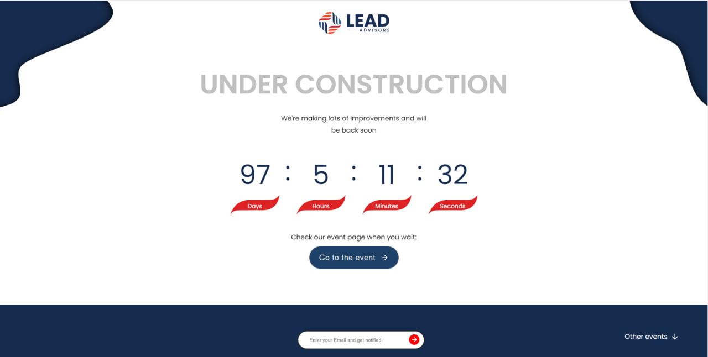
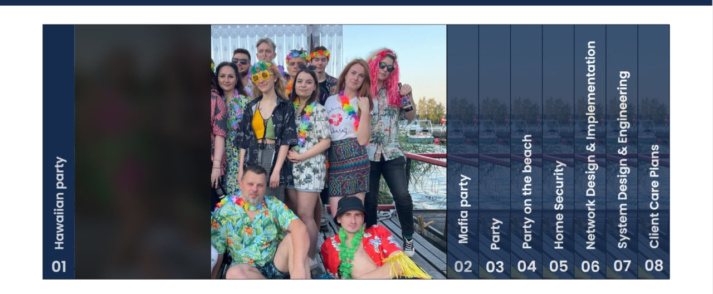
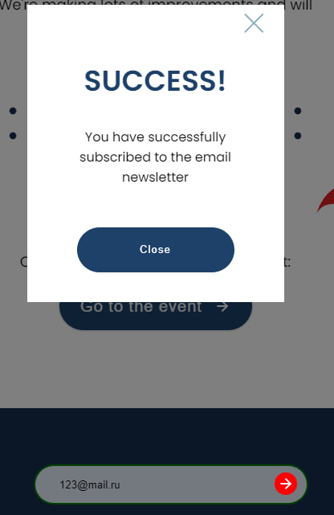

# egorovagency-test-case

## Completed test task for the company Egorov Agency.

The work was performed using Js Basic, CSS/HTML. 
1. Made an adaptive page layout. 
2. The bottom of the desktop is pressed to the bottom of the screen.
3. Implemented an interactive countdown from the current date to 31.05.2023.
4. Implemented validation of the subscription form in the footer and sending data to the server.
5. After submitting the form, a popup appears with a success message. If the validation is unsuccessful, the input is highlighted in red.
6. The Go to the event button is a link to a third-party site, the logo is a link to the current site.
7. Added animation of elements appearance.
8. Accordion animation implemented.

## Front-Page

## Accordion

## Popup after successful registration

